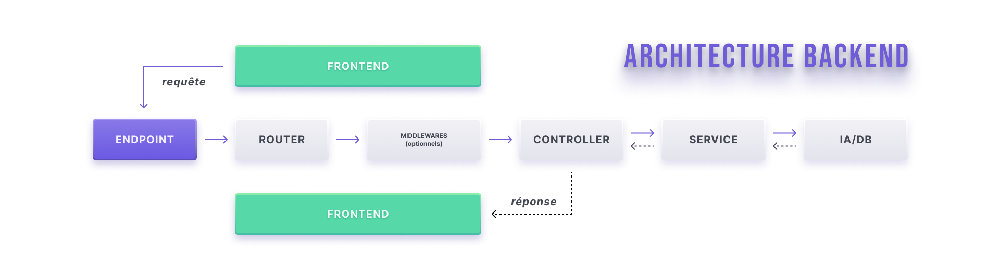

# 📚 Documentation Backend – API REST

> Ce document fournit un aperçu de l'architecture, du flux de requêtes, des conventions de développement de notre service backend, et les étapes pour le récupérer et l'utiliser.

## 1. Présentation générale
* L'objectif de ce backend est de servir une page web pour faire de la transcription speech-to-text, suivant 3 modes : Batch, streaming et diarization.
Il se compose d'une API, de 3 queues et de 3 workers(respectivement pour les 3 modes).

| Mode        | Queue Redis         | Worker associé       |
| ----------- | ------------------- | -------------------- |
| Batch       | `batch_queue`       | `batch_worker`       |
| Streaming   | `streaming_queue`   | `streaming_worker`   |
| Diarization | `diarization_queue` | `diarization_worker` |

### Stack technique 
* Langage : Python
* Framework : Flask
* API : REST
* Queue : Redis
* Worker : Processus séparé (consommateur de la queue)
* Base de données : PostgreSQL

## 2. Architecture du projet et convention

### ⚙️ Architecture Générale et Flux de Requête

Le diagramme ci-dessous illustre comment une requête HTTP transite à travers les différents composants logiciels :



Chaque composant logiciel a un role bien précis à respecter si l'on veut un code qui soit maintenable et compréhensible.

---

### 🧭 Routes (Le Régulateur de Trafic)
/app/Routes
### Définition
Le composant **Routes** est le point d'entrée qui associe l'URL de la requête entrante au gestionnaire approprié (**Controller**).

> **🚦 Fonction Principale :** Contient la logique d'aiguillage et de distribution des requêtes HTTP vers les bonnes destinations.

---

### 🛡️ Middlewares (Les Agents de Contrôle)
/app/Middlewares
### Définition
Les **Middlewares** sont une suite de fonctions exécutées successivement lors du traitement d’une requête HTTP.

> **✅ Fonction Principale :** Gérer des tâches transversales (authentification, journalisation, validation, etc.) **avant** que la requête n'atteigne le contrôleur final. ( en bref c'est un filtre )

* **Pipeline de Traitement :** Plusieurs Middlewares peuvent s'enchaîner pour former un **pipeline** de traitement.
* **Réutilisabilité :** Ils sont conçus pour être réutilisés sur plusieurs routes.
* **Organisation :** Ils sont regroupés dans un répertoire dédié (`/middlewares`).
* **🛑 Prérogative Atypique :** Un Middleware peut **avorter** le traitement d'une requête et retourner immédiatement une réponse (ex: `401 Unauthorized`) sans jamais exécuter le Controller.

---

### 🎬 Schémas (nettoie et complète)

### 🎬 Controllers (Le Gestionnaire d'Opérations)
/app/Controllers
### Définition
Le **Controller** est chargé d'orchestrer la réponse en utilisant les **Services**. Il est le lien entre le protocole HTTP et la logique métier.

> **🤝 Fonction Principale :** Traiter la requête entrante, déléguer la logique métier, et **construire la réponse** appropriée à retourner au client.

### Rôles et Conventions

1.  **Prérogative I (Aller) :** Chaque méthode reçoit la requête et **transmet les données utiles** à un ou plusieurs Services.
2.  **Prérogative II (Retour) :** **Retourne la réponse finale** (JSON, statut HTTP) attendue par le client.

#### ⚠️ Points Cruciaux
* **Limitation :** Le Controller devrait se limiter strictement aux deux prérogatives ci-dessus (Réception et Retour).
* **Délégation :** Toute la **logique métier complexe** doit être déléguée aux **Services**.
* **Structure :** Un Controller gère généralement l’ensemble des méthodes associées aux routes d'une même ressource.

---

### 🛠️ Services (Le Cœur de la Logique Métier)
/app/Services
### Définition
Les **Services** centralisent la logique métier et les traitements complexes pour garantir un code modulaire, réutilisable et facile à maintenir.

> **🧠 Fonction Principale :** Centraliser l'essentiel de la **logique métier** et les interactions avec les données (Models/Repositories).

### Principe de Conception

* **Prérogative :** Le Service **exécute** les actions et les transformations nécessaires.
* **SOLID (SRP) :** Un Service ne doit posséder qu'une **unique responsabilité** (une seule raison d'être modifié), conformément au **Single Responsibility Principle**.

---

### 🛠️ Helpers (Fonction utilitaire)
/app/Helpers
### Définition
Les **Helpers** regroupent des fonctions utilitaires

> **Fonction Principale :** Regrouper des fonctions utilitaires

---
### Convention des réponses API
**Réponse standard (succès)**
```json 
{
    "data": {},
    "status": "succès"
}
```
**Réponse d’erreur**

```json 
{
    "status": "error",
    "message": "Description de l'erreur"
}
```

### Rôle et principes de construction d’une API et d’un Worker
### 1. API Flask

L’API Flask constitue la couche d’entrée du système.

**Responsabilités :**
* Exposer des routes HTTP permettant de déclencher des actions métier
* Valider les entrées (format, schéma, autorisations)
* Déléguer le traitement asynchrone en ajoutant des messages dans les queues Redis

> ⚠️ L’API ne réalise aucun traitement lourd. Elle doit rester rapide et synchrone.

### 2. Workers

Les Workers sont des processus indépendants chargés du traitement asynchrone.

**Principes fondamentaux :**

* Les workers ne contiennent aucune logique métier propre

* Toute la logique métier est centralisée dans les Services partagés

**Responsabilités :**

* Consommer les messages depuis les queues Redis

* Appeler les services appropriés en fonction du type de tâche

**Gérer la robustesse du traitement (Pas encore implémenté) :**

* Retry

* Gestion des erreurs

* Journalisation (logs)

> Objectif : garantir un traitement fiable, isolé et scalable des tâches longues ou coûteuses.

### 3. Configuration et principe de création d'une app (worker ou api)

Bien que les API et les Workers partagent une base de code commune (services, helpers, configuration globale), chacun possède :

* Un contexte d’exécution différent
* Des besoins de configuration spécifiques (queues accessibles, variables d’environnement, dépendances)

👉 Exemple :

Une API doit pouvoir publier des messages dans une queue et un worker doit pouvoir consommer cette même queue.

Pour répondre à ces besoins, chaque API ou worker dispose de sa propre configuration au moment de sa création.

C’est pourquoi, dans le fichier /app/__init__.py, chaque composant (API ou worker) possède un constructeur dédié qui hérite d’une configuration de base commune (/Config/BaseConfig.py) tout en étendant cette configuration selon son rôle.

> 🧩 Cette approche favorise la réutilisabilité, la clarté architecturale et la maintenabilité du code.

## ENDPOINTS API

### 📦 Batch Transcription – Gestion des tâches et récupération de la transcription par polling
**Endpoint**
```POST /api/batchtranscription/createJob```

**Description**

Ajoute une tâche de transcription audio dans la queue Redis afin d’être traitée par le worker Batch.

**Body**

```json 
{
    "audioFile" : audio.m4a
}
```
📌 audioFile : fichier audio à transcrire (format supporté selon la configuration du service).

**Réponse - Accepted**
```json
{
    "data": {
        "job_uuid": "7a85ed93",
        "status": "Votre demande est dans la file d'attente"
    },
    "status": "success"
}
```
**Comportement :**
* Crée un nouveau job de transcription en BDD
* Ajoute la tâche dans la queue Redis batch
* Retourne immédiatement l’identifiant unique du job (job_uuid)

**Endpoint**
```GET api/batchTranscription/result?job_uuid=7a85ed93```


| Nom        | Type         | Description       |
| ----------- | ------------------- | -------------------- |
| job_uuid       | `string`       | `Identifiant unique du job retourné lors de la création       |

```json 
{
    "status": "success",
    "data": {
        "job_id": "7a85ed93",
        "status": "COMPLETED",
        "transcription": "Coucou je suis une pitite transcription"
    }
}
```
**Comportement**
* Vérifie l'état du job correspondant au job_uuid
* Si le job est terminé (COMPLETED), retourne la transcription
* Si le job est encore en cours retourne son statut actuel

> ⏳ Le client est responsable du polling de cet endpoint jusqu’à la complétion du job.(je suis conscient que ça n'est pas la meilleure methode ici mais pour l'instant c'est fonctionnel et ça sera à améliorer surement par websocket)

## Récupérer le projet

initialiser redis
initialiser postregres
lancer le worker
lancer l'api
modifier les variables d'env