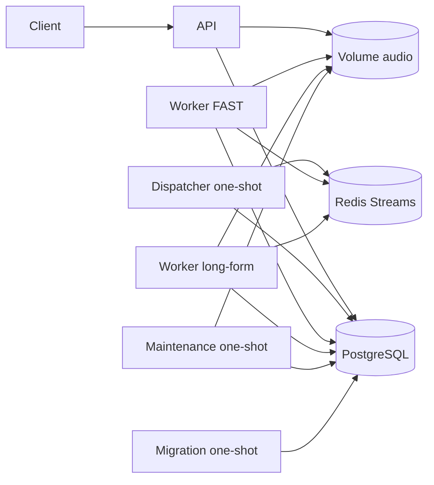

# Architecture du backend

## Vue d'ensemble

Le backend sépare le protocole HTTP, la distribution, l'inférence et les tâches
d'exploitation. PostgreSQL conserve l'état métier durable. Redis peut perdre ou
dupliquer des messages sans remettre en cause cet état.



Redis n'apparaît pas sur le chemin critique de l'API. Une panne Redis empêche
temporairement le dispatch et le traitement, mais pas la création durable d'un
job.

## Applications

### API

- Type de processus : serveur ASGI long-lived.
- Entrée : commande `api`.
- Dépendances indispensables : PostgreSQL, volume audio et `ffprobe`.
- Responsabilité : valider l'upload, stocker l'audio, créer le job puis exposer
  son statut et son résultat.
- Hors périmètre : Redis, dispatch, retry et inférence.

L'architecture interne suit cette direction :

```text
Routes -> Controllers -> Services -> Repositories / Storage / Media
```

Les routes ne portent pas de règle métier. Les controllers traduisent HTTP. Les
services possèdent les use cases et leurs transactions. Les schémas Pydantic
définissent uniquement le contrat public.

### Dispatcher

- Type de processus : tâche one-shot planifiée par l'infrastructure.
- Entrée : commande `dispatch-transcriptions`.
- Dépendances : PostgreSQL et Redis.
- Ordre d'un cycle : recovery des leases, réconciliation, puis dispatch.
- Hors périmètre : boucle permanente, inférence et déduplication Redis.

Plusieurs dispatchers peuvent observer le même job. Les transitions
compare-and-set et le claim PostgreSQL des workers rendent cette concurrence
sûre.

### Workers

- Type de processus : consommateurs long-lived, séquentiels par instance.
- Entrées : `worker-fast` et `worker-long-form-diarization`.
- Dépendances : PostgreSQL, Redis, volume audio et moteur ML.
- Runtime : partagé dans `transcribe_ai_shared.worker`.
- Différence entre applications : type de stream et adaptateur ML.

Chaque instance consomme au plus un message à la fois. Le moteur reste chargé
entre deux jobs. Le parallélisme se fait par replicas, en tenant compte de la
RAM ou VRAM consommée par chaque modèle.

### Maintenance

- Type de processus : tâche one-shot planifiée par l'infrastructure.
- Entrée : commande `cleanup-storage`.
- Dépendances : PostgreSQL et volume audio.
- Responsabilité : supprimer prudemment les audios terminés ou orphelins.
- Principe : en cas d'incertitude, conserver le fichier.

### Migration

- Type de processus : tâche one-shot de déploiement.
- Entrée : commande `database-migrate`.
- Dépendance : PostgreSQL.
- Responsabilité : appliquer `alembic upgrade head` avant les applications.

## Package partagé

`transcribe-ai-shared` expose les contrats et implémentations utilisés par
plusieurs processus :

- `database` : modèles SQLAlchemy, moteurs, sessions et repositories ;
- `queue` : payloads, sérialisation et adaptateur Redis Streams ;
- `storage` : URI audio, protocoles et stockage filesystem ;
- `worker` : claim, heartbeat, finalisation, échec et boucle commune ;
- `observability` : formatter JSON et helper de logs structurés ;
- `retry_policy.py` : limite commune des tentatives ;
- `worker_healthcheck.py` : sonde PostgreSQL et Redis sans serveur HTTP.

Le package partagé ne choisit aucun moteur ML et ne doit importer aucune
application. Une logique utilisée par une seule application reste dans cette
application, même si elle repose sur des protocoles partagés.

## Modèle de données

`TranscriptionJob` porte :

- l'identité `job_uuid` ;
- le profil `job_type` ;
- l'état `QUEUED`, `PROCESSING`, `COMPLETED` ou `FAILED` ;
- l'URI audio opaque ;
- `dispatch_required` et `last_dispatched_at` ;
- `attempt_count` et `last_error` ;
- le lease `lease_owner` et `lease_expires_at` ;
- les horodatages du cycle de vie.

`TranscriptionResult` utilise `job_uuid` comme clé primaire et clé étrangère.
Il ne peut donc exister qu'un résultat final par job. Son JSONB contient le
résultat standardisé produit par l'adaptateur ML.

Trois index partiels accélèrent le travail actif :

- `idx_job_dispatch` pour les jobs `QUEUED` à publier ;
- `idx_job_expired_lease` pour les jobs `PROCESSING` expirés ;
- `idx_job_stale_dispatch` pour les publications anciennes à réconcilier.

Les modèles Python et les migrations Alembic doivent évoluer ensemble. Une
modification du modèle seule ne modifie jamais une base existante.

## Redis Streams

Deux streams logiques existent :

- `transcription:fast` pour `FAST` ;
- `transcription:long-form-diarization` pour
  `LONG_FORM_DIARIZATION`.

Le payload contient `job_uuid` et `attempt_count`. Le stream porte le type de
job. Chaque message reçu expose aussi son `redis_message_id`.

Les groupes sont créés de manière idempotente avec `MKSTREAM`. Le projet cible
Redis 8.10.1 et utilise `XACKDEL` avec `KEEPREF`. Le contrat courant suppose un
seul groupe métier par stream et plusieurs consumers possibles dans ce groupe.

## Stockage audio

`AudioStorage` est le port consommé par l'API et les workers. Son implémentation
actuelle, `FileSystemAudioStorage`, écrit :

```text
{AUDIO_STORAGE_PATH}/{job_uuid}/input.{extension}
```

Le fichier est copié vers un temporaire local au dossier, synchronisé, puis
publié par renommage atomique. Les appelants persistent uniquement
`AudioLocation.uri`, jamais le chemin construit manuellement.

La racine doit être un volume partagé inscriptible par l'API et la maintenance,
et lisible par les workers. Cette abstraction permet une future implémentation
S3 sans changer les services ou le runtime.

## Direction des écritures

- L'API crée uniquement des jobs `QUEUED` et les fichiers audio.
- Le dispatcher modifie le dispatch et récupère les leases expirés.
- Les workers claim, renouvellent, finalisent ou programment un retry.
- La maintenance supprime uniquement des dossiers audio selon sa politique.
- La migration modifie le schéma, jamais les données métier courantes.

Ces limites sont intentionnelles. Déplacer une transition dans un autre
composant doit être justifié comme une décision d'architecture.

## Décisions structurantes

- Livraison at-least-once plutôt que déduplication Redis.
- PostgreSQL plutôt que l'idle Redis pour décider qu'un traitement est mort.
- Transactions courtes : aucune session PostgreSQL ouverte pendant l'inférence.
- Pas de serveur HTTP dans les processus one-shot ou workers.
- Adaptateurs ML isolés des mécanismes de transport et de persistance.
- Cleanup conservateur pour éviter la perte d'un audio encore référencé.
- Logs structurés limités à une liste positive de champs non sensibles.

Le détail temporel de ces décisions est décrit dans
[workflows.md](workflows.md).
