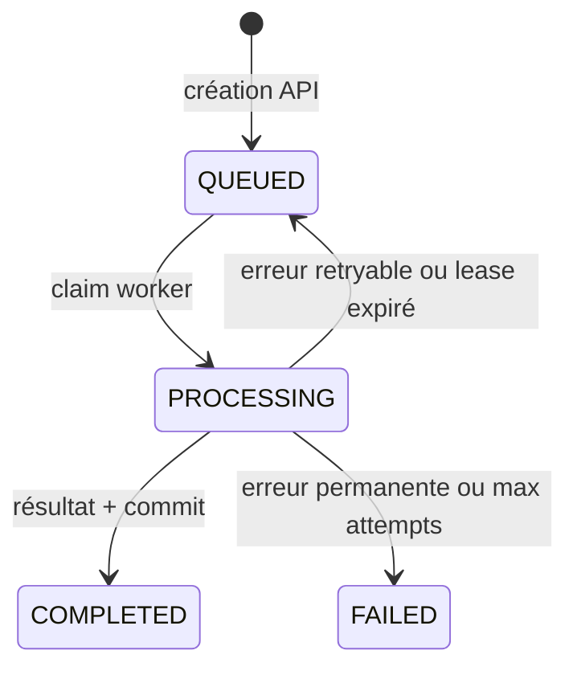

# Workflows et invariants

## Cycle de vie métier



`attempt_count` commence à `0`. `MAX_ATTEMPTS` compte l'exécution initiale :
avec `3`, les attempts autorisés sont `0`, `1` et `2`.

## Création d'un job

Le flow de `POST /api/transcriptions` est :

```text
multipart HTTP
-> prévalidation des métadonnées et de la taille
-> écriture streaming sur le volume
-> inspection réelle par ffprobe
-> validation du format et de la durée
-> transaction PostgreSQL créant le job QUEUED
-> 202 Accepted
```

L'état initial est :

- `status = QUEUED` ;
- `attempt_count = 0` ;
- `dispatch_required = true` ;
- `last_dispatched_at = NULL` ;
- aucun propriétaire ou délai de lease.

L'audio est stocké avant l'ouverture de la transaction PostgreSQL. Ces deux
ressources ne forment pas une transaction distribuée. En cas d'erreur certaine
avant le commit, l'API supprime l'audio. Si le commit a pu réussir mais que son
acquittement est perdu, l'API relit le job :

- job retrouvé : la création est considérée comme réussie ;
- job absent ou relecture impossible : l'API retourne une erreur mais conserve
  actuellement l'audio par prudence.

La maintenance supprimera ensuite un éventuel orphelin ancien. Redis n'est
jamais appelé dans ce flow.

## Dispatch

Le dispatcher sélectionne par batch :

```text
status = QUEUED AND dispatch_required = true
```

Pour chaque snapshot :

1. publier `job_uuid` et `attempt_count` dans le stream du `job_type` ;
2. seulement après le succès de `XADD`, confirmer dans PostgreSQL ;
3. continuer avec les autres jobs si une entrée échoue.

La confirmation met `dispatch_required=false` et
`last_dispatched_at=NOW()`. Elle vérifie l'UUID, l'attempt observé, la demande de
dispatch et l'horodatage précédent. Elle ne requiert pas nécessairement
`status=QUEUED`, car un worker peut avoir claim le job entre `XADD` et cette
confirmation.

Si `XADD` réussit mais que la confirmation PostgreSQL échoue, une exécution
future peut republier le même attempt. Ce doublon est attendu.

## Traitement réussi par un worker

Le flow obligatoire est :

```text
XREADGROUP COUNT 1
-> validation du payload Redis
-> claim PostgreSQL atomique
-> inférence avec heartbeat
-> INSERT résultat + UPDATE COMPLETED
-> COMMIT PostgreSQL
-> XACKDEL Redis
```

Le claim accepte uniquement un job `QUEUED` du bon type et du même
`attempt_count`. Il passe le job à `PROCESSING`, définit `lease_owner` et
`lease_expires_at`, puis committe avant l'inférence. Aucune transaction
PostgreSQL ne reste ouverte pendant le calcul ML.

Le heartbeat renouvelle périodiquement le lease dans une transaction courte.
Il vérifie :

- le `job_uuid` ;
- `status = PROCESSING` ;
- le `lease_owner` courant ;
- l'`attempt_count` courant ;
- un lease qui n'est pas déjà expiré.

Un dernier renouvellement précède la finalisation. Si la propriété est perdue,
le worker ne persiste pas aveuglément son résultat et n'ACK pas le message.

La finalisation insère `TranscriptionResult` et passe le job de `PROCESSING` à
`COMPLETED` dans une seule transaction. L'UPDATE vérifie encore le propriétaire,
l'attempt et l'existence du résultat. La clé primaire du résultat en garantit
au plus un. Le chemin applicatif supporté garantit donc :

```text
job finalisé par le service => exactement un TranscriptionResult
```

La base seule n'empêche pas un UPDATE manuel incohérent vers `COMPLETED`, et la
forme détaillée du JSONB reste une convention d'adaptateur. L'API détecte un job
`COMPLETED` sans résultat et retourne une erreur serveur.

Un crash après le commit et avant l'ACK laisse un message pending. Lors de sa
redelivery, le job déjà `COMPLETED` refuse le claim ; le message est alors
ACK/supprimé sans seconde inférence.

## Échec et retry

Le transcriber produit ou laisse classifier une erreur :

- retryable : l'opération peut réussir lors d'un nouvel attempt ;
- permanente : un nouvel attempt ne corrigera pas la cause.

Les messages bruts d'exception ne sont ni persistés ni exposés. PostgreSQL
reçoit uniquement un code stable et non sensible.

Avec des attempts restants, une transaction effectue :

```text
PROCESSING -> QUEUED
attempt_count += 1
dispatch_required = true
lease_owner = NULL
lease_expires_at = NULL
last_error = code stable
```

Après le commit, l'ancien message Redis est supprimé. Le dispatcher publiera un
nouveau message portant le nouvel `attempt_count`.

Pour une erreur permanente ou lorsque `MAX_ATTEMPTS` est atteint, la transaction
passe le job à `FAILED`, nettoie le lease et interdit tout redispatch. Le message
est là encore ACK/supprimé uniquement après le commit.

Si le commit échoue ou devient incertain, aucun ACK n'est effectué.

## Pending Entries List et `XAUTOCLAIM`

Chaque worker balaie au démarrage puis périodiquement le PEL de son propre
stream. `XAUTOCLAIM` indique seulement qu'un message Redis est resté inactif
assez longtemps. Il ne prouve pas que l'inférence est morte.

Pour un message reclaimé :

- job terminal ou attempt Redis ancien : ACK/suppression sans inférence ;
- job `QUEUED` avec le même attempt : claim normal possible ;
- job `PROCESSING` avec le même attempt : conservation dans le PEL ;
- UUID absent : ACK/suppression selon le contrat de publication actuel.

Un payload invalide reste dans le PEL et nécessite une intervention opérateur.
Sans identité PostgreSQL fiable, le worker ne peut pas le supprimer en sécurité.

## Recovery d'un worker probablement mort

Le dispatcher cherche :

```text
status = PROCESSING AND lease_expires_at < NOW()
```

PostgreSQL fournit l'horloge. Pour chaque snapshot expiré, un compare-and-set
vérifie le statut, l'attempt et la date de lease observée. Un heartbeat réalisé
après la sélection rend la transition obsolète et protège le worker vivant.

S'il reste un attempt, le job repasse à `QUEUED`, l'attempt est incrémenté et le
dispatch est réarmé. Sinon, le job passe à `FAILED`.

Redis ne participe pas à cette décision. L'ancien message sera nettoyé plus
tard par le chemin normal de redelivery.

## Réconciliation après perte Redis

Le dispatcher cherche les jobs :

```text
status = QUEUED
AND dispatch_required = false
AND last_dispatched_at suffisamment ancien
```

Une transition conditionnelle remet `dispatch_required=true`. Elle ne modifie
pas `attempt_count`, car il s'agit d'une republication du même travail et non
d'un retry métier.

Un faux positif peut produire un doublon si le premier message existe encore.
Le claim PostgreSQL rend ce doublon inoffensif.

## Cleanup du stockage

La maintenance inventorie d'abord les dossiers UUID, puis charge les jobs en
batch pour éviter un N+1 PostgreSQL.

- dossier trop récent : conserver ;
- job `QUEUED` ou `PROCESSING` : conserver ;
- job `COMPLETED` ou `FAILED` assez ancien : supprimer ;
- aucun job et dossier assez ancien : supprimer ;
- erreur PostgreSQL, UUID invalide, symlink ou incertitude : conserver.

La suppression revalide un jeton de révision du dossier afin de ne pas effacer
un contenu modifié depuis le scan.

## Gardes de concurrence

Les transitions critiques utilisent des conditions portant sur le snapshot
observé :

- dispatch : UUID, attempt et état de dispatch ;
- claim : UUID, `QUEUED` et attempt ;
- heartbeat : UUID, `PROCESSING`, owner, attempt et lease valide ;
- completion : UUID, `PROCESSING`, owner et attempt ;
- échec : UUID, `PROCESSING`, owner, attempt et lease valide ;
- recovery : UUID, `PROCESSING`, attempt et échéance observée ;
- réconciliation : UUID, `QUEUED`, attempt et date de dispatch observée.

Un retour « zéro ligne modifiée » n'est pas automatiquement une panne : il
signale souvent qu'un autre acteur a déjà fait évoluer le job. L'appelant doit
traiter explicitement ce résultat sans écraser l'état plus récent.
